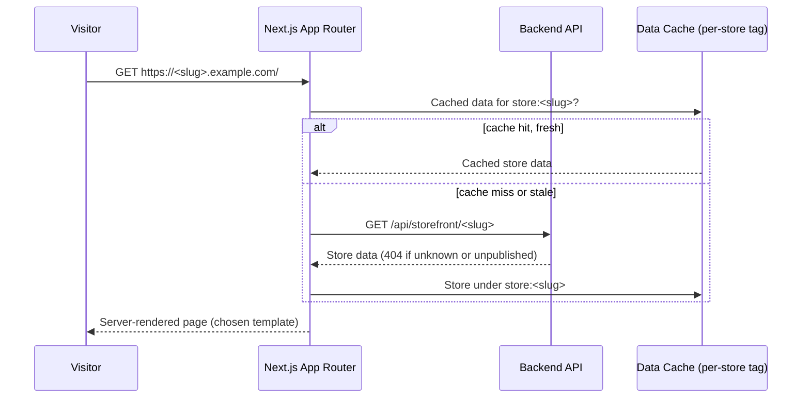
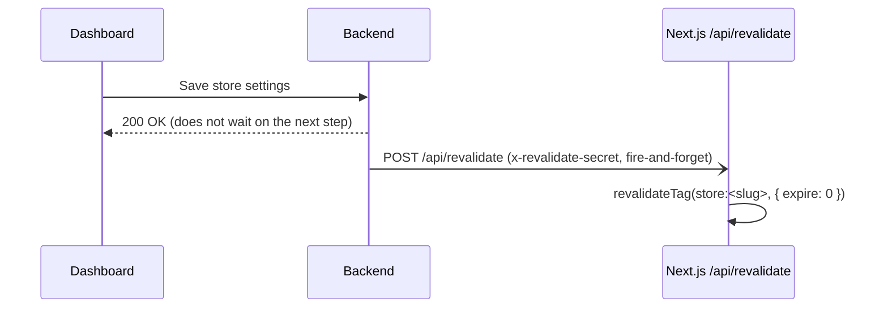

# Storefront Request Flow

```mermaid
sequenceDiagram
    participant Visitor
    participant Next as Next.js App Router
    participant API as Backend API
    participant Cache as Data Cache (per-store tag)

    Visitor->>Next: GET https://<slug>.example.com/
    Next->>Cache: Cached data for store:<slug>?
    alt cache hit, fresh
        Cache-->>Next: Cached store data
    else cache miss or stale
        Next->>API: GET /api/storefront/<slug>
        API-->>Next: Store data (404 if unknown or unpublished)
        Next->>Cache: Store under store:<slug>
    end
    Next-->>Visitor: Server-rendered page (chosen template)
```

## On-demand revalidation (merchant saves a change)

```mermaid
sequenceDiagram
    participant Dashboard
    participant Backend
    participant Storefront as Next.js /api/revalidate

    Dashboard->>Backend: Save store settings
    Backend-->>Dashboard: 200 OK (does not wait on the next step)
    Backend-)Storefront: POST /api/revalidate (x-revalidate-secret, fire-and-forget)
    Storefront->>Storefront: revalidateTag(store:<slug>, { expire: 0 })
```
